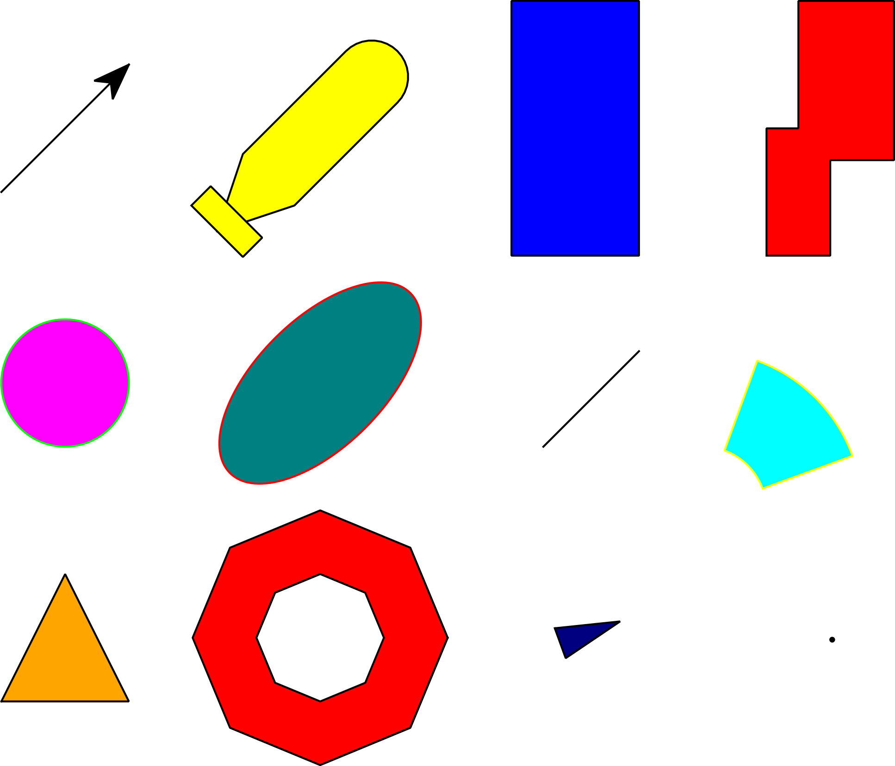

# Getting Started

## Install the viewer

the viewer can be installed with:

```bash
conda install -c benensta vibes-bin
```

## Install

Install python api of vibes with:

```bash
  # using pip
  pip install vibes
  # or using conda
  conda install -b benensta vibes
```

# Basic usage

## First example

The following example shows how to draw your first figure with vibes:

```python
  from vibes import vibes
  # initiate the connection with the viewer
  vibes.beginDrawing()

  # create a new figure
  vibes.newFigure("myfig")

  # draw a circle at (0,0) with radius 2
  vibes.drawCircle(0,0,2)

  # end the connection with the viewer
  vibes.endDrawing()
```

## Shape
Available shapes are:

+ Arrow
+ AUV
+ Box
+ BoxesUnion
+ Circle
+ Ellipse
+ Line
+ Pie
+ Polygon
+ Ring
+ Vehicle
+ Point



<!--
| drawArrow   | drawAUV  | drawBox     | drawBoxesUnion | drawCircle  |
|-------------|----------|-------------|----------------|-------------|
| drawEllipse | drawLine | drawPie     | drawPoint      | drawPolygon |
| drawRing    | drawText | drawVehicle |                |             |
|             |          |             |                |             | -->


## Colors

### Basic colors
Color can be set using the **color** keyword with a string like **XXX[YYY]**, where
+ XXX is color of the border (default value is *black*).
+ YYY is the color to fill the shape (default is *transparent*).


Available colors are:


Shortcuts exist for:
+ blue :b
+ red: r
+ yellow: y
+ magenta: m
+ green: g
+ black: k
+ white: w

For instance:

```python
# draw a blue square with a red border
vibes.drawBox(0,1, 0,1, color='red[blue]')
# or
vibes.drawBox(0,1, 0,1, color='r[b]')
```

### Custom colors and transparency

Custom color can be set by passing an RGB string (such as "#112233"), or an RGBA string (such as "#112233ff")

For instance:
```python
vibes.drawBox(0,2, 0,3, color='[#22449977]')
vibes.drawBox(1,5, 2,4, color='[#AAAA2277]')
```


## Figure and view management

### Figures management

+ Create a new figure named *figureName*.
  ```python
  vibes.newFigure('figureName')
  ```
+ Select *figureName* as the current figure. Drawing operations will then apply to *figureName*.
  ```python
  vibes.selectFigure('figureName')
  ```
+ Close the figure named *figureName*, or the current figure if no argument is given
  ```python
  vibes.closeFigure('figureName')
  ```
+ Clears the contents of the figure *figureName*, or the current figure if argument is given
  ```python
  vibes.clearFigure('figureName')
  ```
+ Save the figure *figureName*, or the current figure if no argument is given as an image.
  Available format are: png, jpeg, bmp and svg
  ```python
  vibes.saveImage("myImage.png", figure='figureName')
  ```
+ Set properties (position,size,viewbox,...) of *figureName*, or of the current figure if argument is given.
  ```python
  # create a dictionnay of promerties
  params = { "x": 100, # new x position
             "y": 100, # new y positon
             "width": 500, # new width
             "height": 500, #new height
  }
  vibes.setFigureProperties(params, figure="myfig")
  ```
+ Set the size of the figure
  ```python
  vibes.setFigureSize(500,500, figure="myfig")
  ```
+ Set the position of the figure
  ```python
  vibes.setFigurePos(100,100, figure="myfig")
  ```


### Axis management

+ Set axes limits to the bounding box of the drawing.
  ```python
  vibes.axisAuto()
  ```
+ Same as *axisAuto* but with the same ratio on the two axis.
  ```python
  vibes.axisEqual()
  ```
+ Specify the rectangle to be displayed: Lower-left corner (x_lb, y_lb) and a upper-right corner (x_ub, y_ub).
  ```python
  vibes.axisLimits(x_lb, y_lb, x_ub, y_ub)
  ```
+ Set axis labels
  ```python
  vibes.axisLabels("xlabel", "ylabel", figure="optional")
  ```

## Groups

Groups can be created to gather objects which shared common properties (color, ...)

+ Create a new group with the specified *groupName* and parameters.
  ```python
  vibes.newGroup("groupName", params)
  vibes.newGroup("groupName", { format:"r[darkblue]"})
  ```

+ Clear the contents of the group *groupName* in figure *figureName* or the current figure if no argument is given.
  ```python
  vibes.clearGroup("groupName")
  ```

+ Objects can be added to group by using the keyword *group*
  ```python
  vibes.drawCircle(0,0,3, group="groupName")
  ```

Example:
```python
vibes.newFigure("myfig")
# Create a new group with specific format.
# Elements of this group are filled in cyan
vibes.newGroup("myGroup", format="r[cyan]")
vibes.drawCircle(0,0,3, group="myGroup")
vibes.drawBox(0,4,-3,3, group="myGroup")
vibes.drawPie( (0,0), (2,4), [30,60], group="myGroup")
```
